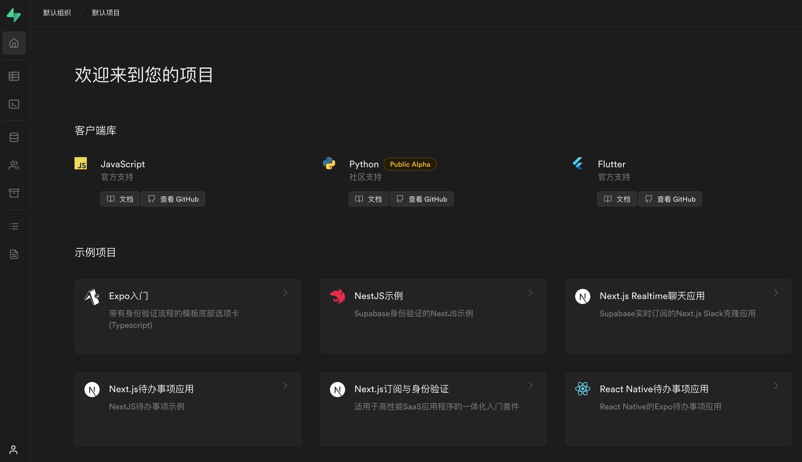

# Supabase中文文档与平台汉化实践

**提示**：如果您想将Supabase作为产品运营或将其商业化，推荐您[移步到此处](https://github.com/supabase/supabase)或更多相关信息请访问[Supabase官网](https://supabase.com)。

此Repo使用Supabase目的仅作为 [Buddy.red](https://buddy.red) DevOps自动化平台实验、实践、演示过程中的研究案例。您可自行下载安装、部署或进一步开发，但如果您将此Repo源码进行商业化出现的任何问题我们概不负责。同时在此不处理本Repo内提交的任何Issue。

## 安装 & 运行

您需要在您的机器上安装和配置以下依赖项来构建Supabase

- [Git](http://git-scm.com/)
- [Node.js v16.x (LTS)](http://nodejs.org)
- [npm](https://www.npmjs.com/) version 8.x.x 或 [Yarn](https://yarnpkg.com/)

## 本地开发

我们已将此存储仓迁移到monorepo，使用[Turborepo](https://turborepo.org/docs)

最终，所有应用程序都将使用[Turborepo](https://turborepo.org/docs)运行，这是改善开发人员工作流程的一种方式。

### 下载源码

1. 克隆/下载源码:

   ```sh
   git clone https://github.com/buddy-red/Supabase-Chinese-Translation.git
   ```

2. 转向目录:

   ```sh
   cd Supabase-Chinese-Translation
   ```

### 运行turborepo

[**Supabase**](https://supabase.com)使用[**Turborepo**](https://turborepo.org/docs)来管理和运行此monorepo

1. 存储仓根目录中安装依赖项

   ```sh
   npm install # 安装依赖项
   ```

2. 之后，您可同时运行以下应用程序：
   ```sh
   npm run dev # 运行所有应用
   ```

然后访问并编辑以下任何站点：

| 站点 | 目录 | 名称 | 描述 | 本地访问地址 |
| --- | ------------ | ---------- | --------------- | --------------------- |
| 主站 | `/apps/www` | www | 网站首页/主站页面 | http://localhost:3000 |
| 平台 | `/studio` | studio | 系统平台/仪表板 | http://localhost:8082 |
| 文档 | `/apps/docs` | docs | 文档、指南与参考(基于Next.js) | http://localhost:3001/docs |

## 单独运行站点

您可单独运行站点，例如:

```sh
npm run dev:www
```
## Supabase介绍

[Supabase](https://supabase.com) 是一个开源的 Firebase 替代品。我们正在使用企业级的开源工具构建 Firebase 的功能。

- [x] Postgres数据库托管
- [x] 身份验证和授权
- [x] API自动生成
  - [x] REST
  - [x] GraphQL
  - [x] Realtime订阅
- [x] 函数。
  - [x] 数据库函数
  - [x] 边缘函数
- [x] 文件存储
- [x] 仪表板

